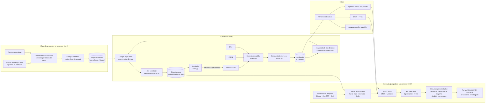

# LITIGIA

Un abogado litigante describe el caso que está trabajando y LITIGIA le devuelve **los fallos que resolvieron la misma cuestión jurídica**, con el párrafo exacto para citar, separados en **a favor** y **en contra**. Tiene que ser muy preciso y costar centavos por consulta.

**El producto es la base de datos etiquetada; la búsqueda es solo cómo se consulta.** Cada fallo entra por un scraper, pasa un contrato de calidad y se etiqueta con las preguntas que se haría un litigante **según el tipo de caso**. Un job diario mantiene todo al día. Se construye paso a paso: un fuero a la vez, y cada paso se cierra solo con una condición medida.

Este documento tiene dos partes:

1. **El criterio del abogado:** qué hace valioso a un fallo y cómo LITIGIA le saca el jugo.
2. **La arquitectura:** del scraper a la búsqueda, qué decidimos, por qué, y qué medimos.

**El MVP es un conector MCP:** el abogado usa LITIGIA desde su propio asistente de IA (Claude, ChatGPT, Grok o Gemini). Su asistente entiende el relato y redacta; LITIGIA pone las balas. La app propia queda para después. Plan completo en [docs/PLAN_MVP.md](docs/PLAN_MVP.md).

Estado a 2026-09-29: la capa de datos está construida y probada (scraper del PJN con contabilidad fallo por fallo, contrato de calidad, catálogo, enriquecimiento, auditoría y conciliación; 139 tests). Hay un año de la Cámara Nacional del Trabajo (22.470 fallos) y se está bajando el año de seguridad social, contencioso administrativo federal, civil y comercial (~56.500). Jev está probado en castellano jurídico. El etiquetado por tipo de caso, la búsqueda y el conector están diseñados, no construidos.

---

## Parte 1 — El criterio del abogado litigante

### Cómo busca un litigante

Un abogado no busca "fallos parecidos": busca **munición para un escrito concreto**. Delante de cada fallo se hace seis preguntas, y LITIGIA tiene que contestarlas sin que abra el PDF:

| # | Pregunta del abogado | Qué la contesta en LITIGIA | Estado |
|---|---|---|---|
| 1 | ¿Resuelve **mi** cuestión jurídica, o solo la menciona? | Búsqueda por párrafo + juez final que decide "misma cuestión: sí / parcial / no" | Búsqueda validada (benchmark); juez pendiente |
| 2 | ¿Quién lo dijo? ¿Es la **misma Sala** que me va a tocar? ¿Fue unánime? | `tribunal`, `sala`, `votos`, `por_mayoria` | ✅ |
| 3 | ¿Cómo terminó? ¿Es **favorable o contrario** a mi parte? | `resultado` (confirma / modifica / revoca…) + quién apeló | `resultado` ✅; quién apeló pendiente |
| 4 | ¿Sigue firme? ¿Llegó a la Corte? | Cadena procesal por expediente (PJN ↔ CSJN) | Pendiente (17% de la muestra tiene expediente en la CSJN) |
| 5 | ¿Cómo lo cito? | Tribunal, Sala, fecha, carátula, expediente, N° de sentencia, link al PDF oficial | ✅ (N° de sentencia solo cuando el fallo lo trae: 15%) |
| 6 | ¿Dónde está exactamente lo que resolvió sobre mi punto? | El **párrafo** que ganó la búsqueda, literal | Validado en el benchmark |

> ⚠️ Esta lista está armada con conocimiento general del litigio en Argentina, más una investigación con fuentes sobre 7 fueros. Un abogado litigante tiene que validarla con el piloto del conector.

### Qué hace valioso a un fallo (en orden de peso)

1. **Resuelve la misma cuestión, no solo el mismo tema.** "Despido" es un tema. "¿Procede la multa del art. 80 LCT si el certificado se entregó tarde pero antes de la demanda?" es una cuestión. La diferencia entre las dos es la diferencia entre ruido y precisión.
2. **Jerarquía y cercanía.** CSJN > tribunal superior > **la misma Sala que va a resolver** > otras Salas > primera instancia. Lo que más pesa es lo que ya dijo tu tribunal.
3. **Lo que se decidió, no lo que alguien sostuvo.** Un fallo relata los agravios de las partes y después decide. Citar el agravio como si fuera el criterio del tribunal es un error grave. Lo mismo vale para un voto en minoría.
4. **Criterio consolidado.** Si la misma Sala repite el mismo párrafo en varias causas, ese criterio vale más que un caso aislado. Lo medimos: los "votos modelo" se repiten textualmente (RIPTE, art. 80 LCT).
5. **Vigencia.** Un fallo anterior a una reforma (por ejemplo, la Ley 27.348) puede no servir.
6. **A favor y en contra.** El abogado necesita los dos: los favorables para citar, los contrarios para anticiparse y distinguirlos antes que la contraparte.
7. **Números, en el fuero laboral.** Qué tasa de interés aplica la Sala (Actas CNAT 2658, 2764, 2783), si actualiza por RIPTE, qué % de incapacidad y qué montos reconoció.

### Qué le mostramos (la ficha, sin texto generado)

Ejemplo ilustrativo (combina datos de fallos distintos de la muestra):

```
A FAVOR · 92% · misma cuestión          ⚖ Misma Sala que tu causa · criterio reiterado en 4 fallos
CNAT Sala IV · 04/03/2024 · SD 115.631
"GONZALEZ ARAGON c/ ASOCIART ART S.A. s/ accidente - ley especial" · Expte. CNT 49971/2016
Confirma · Votos: Pinto Varela, Guisado · Normas: ley 24.557, ley 27.348
¶18 "…una sanción pecuniaria, a favor del trabajador, cuando el empleador no entrega los certificados previstos por el art. 80 LCT…"
[Ver PDF oficial]  [Copiar cita]
```

Todo lo que aparece en la ficha sale de datos que ya existen: metadatos, campos extraídos con regex, decisiones del juez y un párrafo literal. **No se genera texto**, así que no hay nada que se pueda inventar. Si ningún fallo supera el umbral de certeza, se muestra "no hay fallos con precisión suficiente", no resultados dudosos.

### Cómo se consulta: el conector

El abogado agrega LITIGIA como conector MCP en su asistente de IA y cuenta el caso con sus palabras. Su asistente llama a las herramientas de LITIGIA con los datos del caso:

| Herramienta | Qué devuelve |
|---|---|
| `buscar_fallos` | Fichas (desde v1, separadas en a favor y en contra) con el párrafo literal y el link al PDF |
| `ver_fallo` / `citar` | La ficha completa y la cita lista para el escrito |
| `preguntas_del_caso` | Los datos que faltan para afinar la búsqueda, según el mapa de preguntas (v1) |
| `tendencia_sala` | Cómo resuelve cada Sala ese punto, con cantidad de fallos (v2) |

LITIGIA no genera texto jurídico: devuelve datos y párrafos literales. El asistente del abogado redacta, y el abogado verifica las citas en la fuente.

---

## Parte 2 — Arquitectura

### Vista general



El sistema funciona como un ciclo: **scrapear → verificar el contrato → etiquetar → auditar → mejorar el scraper y el mapa.** Cada cambio se mide contra la auditoría anterior.

### Capa 1 — Scrapers

**PJN** (`scripts/scrapers/pjn_tribunales.py` + `pjn_parse.py`): sentencias de las Cámaras nacionales y federales desde 2013 (Ley 26.856). Es la fuente principal, porque trae texto completo.

Cómo funciona el sitio (verificado en vivo, no supuesto):

| Hecho | Consecuencia en el diseño |
|---|---|
| Cada búsqueda exige un captcha y una sesión nueva | Haiku resuelve el captcha: ~$0,0001 cada uno |
| **Filtra por el campo oculto `tid`** (cámara `C_7` o Sala `T_7_TS1`); `camara_id` solo se ignora | El scraper viejo traía todas las cámaras mezcladas |
| Pagina **reenviando el formulario con un `token`**; un GET a `sentencias.html` devuelve un listado genérico | El "tope de 40" era un bug nuestro, no del sitio |
| Máximo **100 resultados por búsqueda** (5 páginas de 20), pero informa el total real | **Crawl adaptativo:** parte el rango de fechas hasta que cada búsqueda entre en 100; si un solo día supera 100, lo parte por Sala |
| Los metadatos están en el listado (en base64 dentro del link "Ver Fallo") | Tribunal con Sala, expediente, carátula y fecha, sin parsear el PDF |
| El PDF baja sin sesión | Solo las búsquedas consumen captcha |
| La etiqueta "Definitiva" del sitio a veces está mal (1% de la muestra) | El tipo se detecta del texto y se marca `tipo_no_coincide` |
| ~4 búsquedas por minuto por IP | El techo es la velocidad por IP; se escala con varias IPs |

Garantías:
- **Retoma sin perder nada.** Cada búsqueda queda registrada; un día partido por Sala se completa aunque se corte a la mitad.
- **No baja dos veces un PDF.** Si el fallo ya está, solo actualiza sus metadatos (`refreshed`).
- **Falla rápido** ante una API key inválida o sin workspace, en vez de reintentar durante minutos.

**CSJN** (`csjn.py`) y **SAIJ** (`download_datasets.py`, `sync_datasets.py`): funcionan, pero todavía escriben JSONL. Se importan al catálogo con `import_legacy.py`.

### Capa 2 — Contrato de calidad (`scripts/quality.py`)

Define qué necesita un fallo para servirle a la búsqueda. Rechazar es **una etiqueta con motivo, no un borrado**: si una regla resulta muy dura, `audit --reassess` reclasifica todo sin volver a scrapear.

| Estado | Regla |
|---|---|
| `rejected` | Menos de 800 caracteres, o corto (< 4.000) **y** puramente formal: art. 280, queja desestimada, cuestión abstracta, desierto, regulación de honorarios, medida para mejor proveer, queja extemporánea, intimación de depósito, desistimiento |
| `pending` | Tiene texto útil pero le falta algo recuperable: fecha, tribunal, carátula, párrafos, OCR |
| `indexable` | Cumple todo |
| Advertencias | `breve` (menos de 1.500 caracteres pero con contenido), `sin_sala`, `tipo_no_coincide`, `sin_expediente` |

Cada regla nació de un caso real que está como fixture en los tests. Ejemplo: *D'Esposito* (CNAT Sala X) tiene 2 párrafos pero fija el plazo de 15 días para recurrir a la Comisión Médica Central, así que entra. *SITRAMEN* solo declara abstracta la cuestión, así que queda afuera.

Limpieza del PDF: saca sellos de página, firmas, encabezados repetidos y números de página; rearma los párrafos que el PDF cortó por línea; extrae firmantes (solo jueces, no secretarios) y fecha de firma.

### Capa 3 — Enriquecimiento (`scripts/enrich.py`, $0, regex)

| Campo | Cobertura (847 fallos de la CNAT) | Nota |
|---|---|---|
| `objeto` (de la carátula: "DESPIDO", "RECURSO LEY 27348") | 100% | El filtro más barato y preciso por tipo de caso |
| `resultado` (de la parte resolutiva, no de lo que resolvió la primera instancia) | 96% | Confirma 603 · Modifica 146 · Revoca 37 · Rechaza 21 |
| `normas` (normalizadas: "ley 27.348", "LCT art. 80") | 99% | Une "27348" y "27.348" |
| `votos` ("X dijo:") | 91% | Los que faltan son casi todos interlocutorias sin votación |
| `numero` ("SD 115.631") | 15% | Solo cuando el fallo lo trae en el encabezado |
| `por_mayoria` | 5 fallos | La disidencia **no** se detecta con "disiento": en la CNAT esa palabra casi siempre cita a otro juez o descarta un agravio ("mera disidencia") |

### Capa 3b — Etiquetado por tipo de caso (diseñado, pendiente de construir)

La idea central: **según el tipo de caso, el sistema se hace las preguntas que se haría un litigante profesional**, y guarda las respuestas como etiquetas. A un despido no se le pregunta lo mismo que a un accidente.

**Los tipos de caso no se inventan: salen del catálogo oficial.** El texto después de "s/" en cada carátula es el objeto de juicio del PJN. Hay muchos: 25 distintos en solo 3 semanas de la Cámara del Trabajo, y 5.266 variantes en los fallos de la CSJN, donde los 100 más frecuentes cubren apenas el 73%. Por eso la estructura tiene tres niveles:

```
Fuero (cada cámara del PJN)
  └─ Familia de caso (15 a 25 por fuero; agrupa objetos parecidos)
       └─ Objeto de juicio oficial (lo que dice la carátula)
```

**Quién hace qué:**

| Tarea | Quién | Cuándo |
|---|---|---|
| Encontrar qué se discute de verdad en cada familia | **Código**: extrae y cuenta los agravios de los fallos (*"se agravia la demandada porque…"*). Los agravios son literalmente las preguntas que se hicieron los abogados. | Una vez por fuero |
| Redactar las preguntas cerradas, con opciones y definiciones | **Claude**, a partir de los agravios y de fuentes argentinas (leyes comentadas, doctrina, criterios de la Cámara) | Una vez por familia |
| Validar cada pregunta | **Código**: ¿en qué % de los fallos de la familia se puede contestar? Las que no alcanzan se descartan. | Por cada versión del mapa |
| Decidir el tipo de caso de cada fallo | **Jev** (pasada 1). La carátula es una pista, no la respuesta: muchas dicen "incidente" o "queja", que es el trámite. | Una vez por fallo |
| Elegir el set de preguntas del tipo | **Código** | Una vez por fallo |
| Contestar las preguntas | **Jev** (pasada 2): elige una opción, con probabilidad | Una vez por fallo |

**Por qué el código y Claude juntos:** el código solo encuentra palabras y frecuencias, pero no sabe redactar una pregunta; Claude sola redacta bien, pero puede inventar preguntas que casi nunca aparecen en la práctica. Juntos: evidencia más redacción, y el código descarta lo que no se sostiene.

**Por qué las preguntas quedan congeladas:** Claude las escribe **una vez**, antes de etiquetar, y quedan en un archivo versionado (`labels/<fuero>_vN.yaml`). No se generan por cada fallo. Si cada fallo tuviera preguntas distintas, las etiquetas no se podrían comparar ni filtrar: no podrías pedir "todos los despidos donde no se admitió la justa causa". En ejecución todo es fijo: **el código elige el set, Jev contesta.**

**Dos pasadas:**

| Pasada | Preguntas | Ejemplos |
|---|---|---|
| 1. Universal (todos los fallos) | tipo de caso · quién apeló · a favor de quién resultó · costas · rol de cada párrafo (agravio / decisión / relato / trámite) · párrafo del holding | — |
| 2. Específica (según la familia) | Las del mapa de esa familia | **Despido:** ¿se admitió la justa causa? ¿trabajo no registrado? ¿multa art. 80? ¿art. 2 ley 25.323? ¿tope Vizzoti? · **Accidente LRT:** % de incapacidad que fijó la Cámara, ¿cambió respecto de 1ª instancia? ¿daño psicológico? ¿RIPTE? ¿tasa? ¿inconstitucionalidad? |

Los fallos de familias todavía sin mapa quedan como "otro" y reciben solo la pasada 1: ningún fallo queda sin etiquetar. La métrica que guía qué familia mapear después es **el % de fallos en "otro"** por fuero.

**Reglas de las etiquetas:**
- **Jev no escribe texto, elige.** Todo se formula como elección cerrada (máximo 255 opciones) o como índice de párrafo. Para números (% de incapacidad, monto, tasa), el regex encuentra los candidatos en el texto y Jev elige cuál fijó la Cámara.
- **Cada etiqueta guarda su probabilidad y la versión del mapa y del etiquetador.** Por debajo del umbral queda "sin determinar", nunca inventada.
- **El etiquetador es intercambiable:** Jev, con Haiku o un modelo local de respaldo. Se elige midiendo contra el set de verdad, no por lo que anuncia el proveedor.
- **Etapa separada del scraper:** si cambia el mapa, se reetiqueta sin volver a scrapear.

**Estabilidad: la base no fluctúa.** La IA no es determinista, pero esa variabilidad no puede llegar a la base. Una etiqueta tiene que ser igual hoy, mañana y en el fallo de al lado; si no, no le sirve al abogado para su estrategia.

| Riesgo | Regla |
|---|---|
| Preguntas distintas en cada fallo | Mapa congelado y versionado: todos los fallos de una familia responden las mismas preguntas con las mismas opciones. |
| El modelo contesta distinto si se corre dos veces | **Se etiqueta una vez y se guarda.** Las etiquetas se identifican por (fallo, pregunta, versión del mapa, versión del etiquetador). El job diario etiqueta solo fallos nuevos; reetiquetar requiere cambiar una versión a propósito. |
| Casos límite | Umbral de certeza: por debajo queda "sin determinar". |
| Opciones que obligan a elegir | Toda pregunta tiene salida: **"no tratado"** / **"no aplica"**. Preguntas atómicas (un solo hecho) y cada opción con definición escrita. |
| Preguntas inestables | **Prueba de consistencia antes de publicar:** el etiquetador corre 3 veces sobre el set de verdad; si una pregunta no da la misma respuesta de forma consistente, se reescribe o se descarta. |
| El proveedor cambia el modelo | **Versión fijada.** Un modelo nuevo corre en sombra sobre el set de verdad; reemplaza al anterior solo si mide igual o mejor, y se revisan las diferencias. |
| Errores silenciosos | **Cada etiqueta guarda el párrafo que la sostiene** (auditable, y el abogado ve la fuente). Donde hay dos fuentes independientes (regex y Jev, por ejemplo en `resultado`), se cruzan; si no coinciden, el fallo se marca para revisar. |
| Deriva | La auditoría compara la distribución de cada etiqueta contra la anterior; un salto brusco dispara un aviso antes de que llegue al abogado. |

### Capa 4 — Catálogo (`scripts/catalog.py`)

SQLite en `$DATA_ROOT/catalog.db`:

- `UNIQUE(source, source_id)`: un duplicado por ID es imposible. El JSONL viejo acumuló 68.517 duplicados en la CSJN.
- Texto idéntico bajo otro ID → `duplicate`, con referencia al original.
- **WAL:** la auditoría lee mientras el scraper escribe. Sin WAL, una lectura larga bloqueó una corrida real (`database is locked`).
- Las columnas nuevas se agregan solas al abrir una base vieja.
- Tabla `searches`: el total que informó el sitio en cada búsqueda. Es el denominador de la completitud.
- `active` / `disabled_reason`: deshabilitar sin borrar. La auditoría y el índice usan solo `active=1`.

### Capa 5 — Auditoría (`scripts/audit.py`)

Para cada fuente reporta:
- el % de fallos indexables,
- los motivos de rechazo y las advertencias,
- la **completitud contra el sitio**,
- los indexables por fuero y por año,
- **qué cambió desde la auditoría anterior** (cada auditoría queda guardada en `logs/audits/`).

Es la herramienta para decidir qué mejorar.

### Capa 6 — Búsqueda (validada con benchmark, pendiente de construir)

Benchmark sobre 847 fallos de la CNAT (21.108 párrafos), con 8 preguntas redactadas como las escribiría un abogado. Relevancia aproximada: algún párrafo del fallo discute el tema.

> Esta medición es una **señal**: son 8 consultas nuestras y el criterio es flojo. El benchmark que vale para el MVP es [docs/BENCHMARK.md](docs/BENCHMARK.md): **112 fallos conocidos** que citaron terceros y **100 consultas de doctrina**, en los 5 fueros. Las de doctrina se juzgan a ciegas, y todo se mide contra una búsqueda por palabras.

| Método | P@5 | P@10 |
|---|---|---|
| Palabras (BM25, FTS5) | 0,68 | 0,66 |
| **Vector por fallo completo** (bge-m3) | **0,40** | 0,43 |
| Vector por párrafo (bge-m3) | 0,78 | 0,72 |
| Híbrido (RRF) | 0,80 | 0,76 |
| **Híbrido + reranker** (bge-reranker-v2-m3) | **0,85** | **0,77** |

Qué decidimos a partir de esto:

1. **La unidad de búsqueda es el párrafo, no el fallo.** Un fallo trata 4 o 5 temas; el vector del fallo entero los mezcla y es el peor método.
2. **Híbrido + reranker, todo local.** Cuesta $0 por consulta y corre en la GPU: ~4 minutos para indexar 1.000 fallos.
3. **Agrupar párrafos repetidos** y mostrarlos como "criterio reiterado en N fallos", en vez de mostrar copias.
4. **El error que queda son los párrafos de agravio.** Un párrafo que relata lo que sostiene una parte sale arriba como si fuera lo que decidió el tribunal. Hay que clasificar el rol del párrafo (agravio / decisión), con reglas o con el juez.
5. **El juez final decide sobre ~30 candidatos**, no sobre todo el corpus. Candidato: TypeSafe **Jev** (decisiones tipadas con probabilidad calibrada, sin generar texto). Los precios y la calidad que anuncia el proveedor ($0,042 por millón de tokens de entrada) **no están verificados** en castellano jurídico. Va detrás de una interfaz intercambiable, con el reranker local como respaldo.

### Rendimiento medido

| Métrica | Valor |
|---|---|
| Velocidad PJN | ~1.400 fallos por hora por IP |
| Errores (PDF / captcha / búsquedas incompletas) | 0 / 0 / 0 en 721 fallos |
| Costo de captcha | $0,006 cada 721 fallos |
| Completitud contra el sitio | 100% |
| CNAT 2024 completo (~20.000 fallos) | ~15 h con 1 IP, ~1,5 h con 10 IPs |

### Estado de los datos

Solo cuenta lo **activo**. Lo que juntaron los scrapers viejos quedó **deshabilitado**, no borrado: el texto sigue en el catálogo y se reactiva solo cuando el scraper nuevo vuelve a traer ese fallo.

Sentencias definitivas de la justicia nacional de CABA, del 27/09/2025 al 27/09/2026:

| Fuero (cámara) | Informa el sitio | Estado | Nota |
|---|---|---|---|
| Laboral (C_7) | 22.653 | ✅ 22.551 (99,5%) | |
| Seguridad social (C_5) | 35.635 | ✅ 35.582 (99,9%) | Una Sala puede dictar más de 100 fallos en un día: se parte por año del expediente |
| Contencioso administrativo federal (C_2) | 13.088 | ✅ 13.088 (100%) | ~15% son de honorarios o de trámite |
| Civil (C_1) | 6.788 | ✅ 6.764 (99,6%) | La Cámara Civil dicta sobre todo interlocutorias (26.038 en el año) |
| Comercial (C_10) | 948 | ✅ 948 (100%) | Publica muy pocas definitivas |
| **Total** | **79.112** | **✅ 78.933 (99,8%) · 77.546 aptos para búsqueda** | Test de calidad en 4 capas de los 5 fueros: [CALIDAD_DATOS.md](docs/CALIDAD_DATOS.md) |

Cuánto informó el sitio, qué se guardó y qué falló, fallo por fallo: `python -m scripts.reconcile --camara C_5 --desde 2025-09-27 --hasta 2026-09-27`.

Otras fuentes, deshabilitadas: 38.232 fallos del PJN del scraper viejo (sin carátula ni expediente; vuelven al volver a listarlos) y 99.999 de la CSJN (el enriquecimiento todavía no está adaptado al formato de la Corte). SAIJ no está importado: son sumarios.

```python
# Deshabilitar / reactivar (scripts/catalog.py)
cat.disable("first_seen < '2026-09-27 15:00'", reason="scraper_viejo")
cat.enable("disabled_reason = ?", ("scraper_viejo",))
```

---

## Hoja de ruta: el MVP es el conector

El plan detallado (qué entra en el MVP, herramientas del conector, subpasos, criterios de salida, costos y qué hace falta) está en [docs/PLAN_MVP.md](docs/PLAN_MVP.md). **No se pasa a la fase siguiente hasta cumplir el criterio de la actual.**

| Fase | Qué | Estado |
|---|---|---|
| **0** | Datos confiables: scraper con contabilidad, contrato, catálogo, enriquecimiento, auditoría | ✅ |
| **1** | Jev en castellano jurídico | ✅ ([reporte](docs/FASE1_JEV_REPORT.md)) |
| **2** | Cerrar el año de los 5 fueros: conciliación, reglas nuevas, test de calidad, copia de seguridad | ✅ ([calidad](docs/CALIDAD_DATOS.md)) |
| **3** | Motor de búsqueda por párrafo y API | |
| **4** | **Conector MCP v0** y piloto con 2 o 3 abogados en Claude | |
| **5** | Mapa de preguntas por fuero, alimentado por las consultas del piloto | |
| **6** | Etiquetado medido con Jev → **conector v1** (a favor / en contra, mayoría, hecho clave) | |
| **7** | Tendencia por Sala → **conector v2** | |
| **8** | Carga diaria automática | |
| **9** | Cuentas, login y cobro | |

Después del MVP: app web y de celular (Capacitor) sobre la misma API, subir la sentencia o la demanda, Corte Suprema, provincias, interlocutorias.

---

## Uso

### Setup

```bash
cd backend
python -m venv .venv && source .venv/Scripts/activate
pip install -r requirements-dev.txt
```

`backend/.env` (tiene prioridad sobre las variables de entorno del sistema):

```
ANTHROPIC_API_KEY=...         # captcha PJN
ANTHROPIC_WORKSPACE_ID=...    # solo si la key no pertenece a un workspace
VULTR_API_KEY=...             # solo deploy_parallel
DATA_ROOT=D:/litigia-data
```

### Ciclo de trabajo (desde `backend/`)

```bash
# 1. Scrapear. PJN: sentencias definitivas por defecto; parte los rangos para no perder nada y retoma solo
python -m scripts.scrapers.pjn_tribunales --jurisdiccion 5-5 --camara C_7 --desde 2024-01-01 --hasta 2024-12-31
python -m scripts.scrapers.pjn_tribunales --list-camaras 5-5
python -m scripts.scrapers.pjn_tribunales --tipo I            # interlocutorias

# Progreso en vivo (desde cmd, PowerShell o Git Bash)
powershell -ExecutionPolicy Bypass -File scripts\progress.ps1 -Log D:\litigia-data\logs\<corrida>.log -Target 1000

# 2. Auditar
python -m scripts.audit
python -m scripts.audit --reassess      # después de cambiar una regla del contrato o del enriquecimiento

# Datos previos al catálogo (una sola vez)
python -m scripts.import_legacy

# SAIJ
python -m scripts.download_datasets
python -m scripts.sync_datasets

# Tests
python -m pytest tests -q
```

Para correr el scraper durante horas, lanzalo desde tu propia terminal: si lo lanza otra herramienta en segundo plano, muere con ella.

### Estructura

```
backend/
  scripts/
    config.py            settings (.env gana sobre el entorno)
    quality.py           contrato de datos + limpieza de PDF
    enrich.py            objeto, resultado, normas, número, votos, mayoría
    catalog.py           SQLite: documentos + búsquedas, WAL, migraciones
    audit.py             reporte + snapshots + delta
    import_legacy.py     JSONL viejos → catálogo
    progress.ps1         progreso en vivo de una corrida
    scrapers/
      pjn_parse.py       parser + crawl adaptativo (puro, testeado)
      pjn_tribunales.py  sitio PJN: captcha, búsqueda, paginación, PDFs
      csjn.py            Corte Suprema
      deploy_parallel.py VPS en paralelo (desactualizado, ver pendientes)
    normalizers/         SAIJ → esquema
  tests/                 66 tests; fixtures con fallos reales
```
